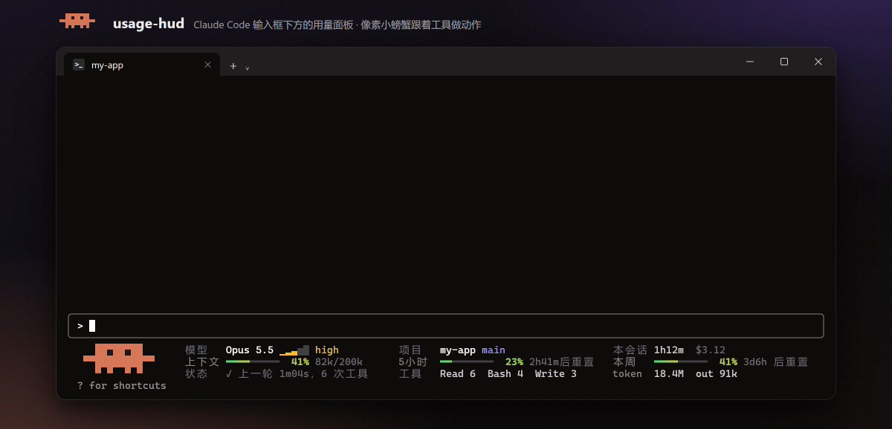
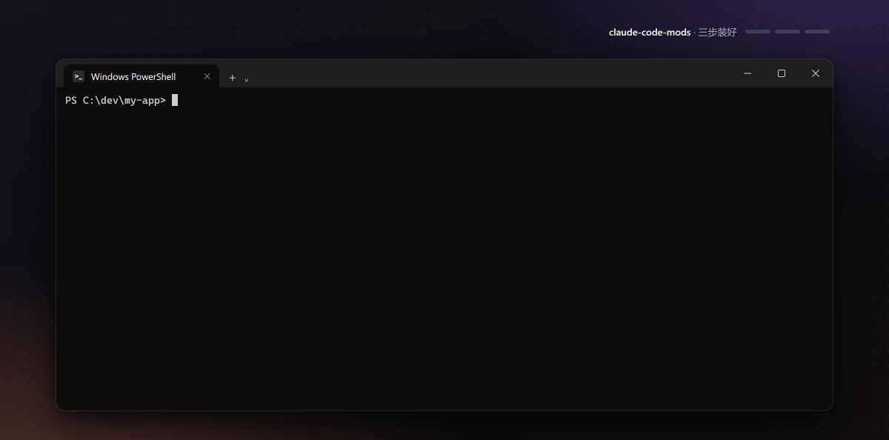
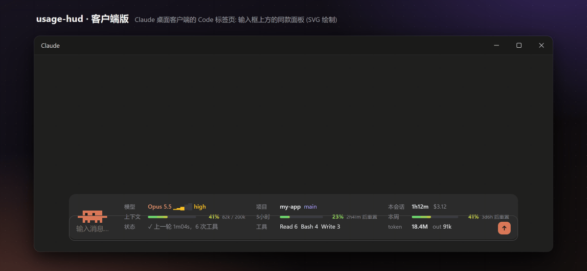
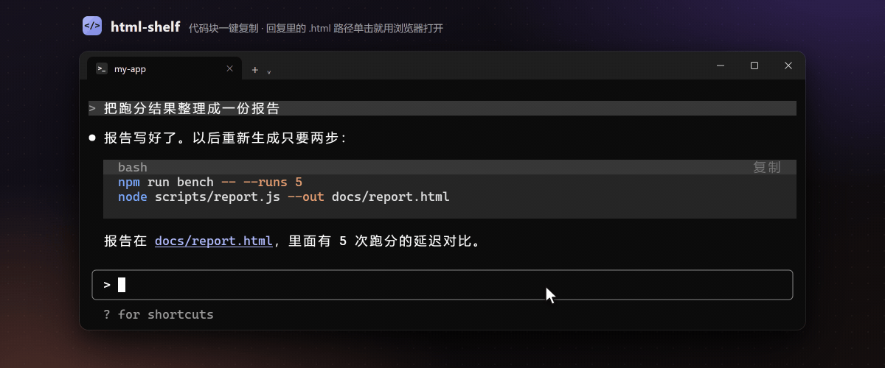

<div align="center">

# claude-code-mods

English | [简体中文](README.zh-CN.md)

**Desktop-app comforts for the Claude Code terminal**

An animated, moody pixel-crab usage panel · one-click file links · code cards you can copy or fill in

[](LICENSE)




</div>

## What is this

Claude Code [mods](https://code.claude.com/docs/en/plugins/mods/overview) are plugins made of function hooks: one folder and a few dozen lines of TypeScript can change what Claude Code itself draws. This repository holds two mods. They don't depend on each other, so you can install just one:

| Mod | What it does |
|---|---|
| **usage-hud** | A usage panel under the prompt. A pixel crab acts out the tool Claude is using, and its mood follows how fast you burn your quota. Model and effort, project and branch, session time and cost, context / 5-hour / weekly usage and tokens, all at a glance. A second crab walks above the prompt with your subagents |
| **html-shelf** | File paths in Claude's replies (HTML, PDF, images, video, folders …) open with one click. Code blocks, and commands written inline, are drawn as cards you can copy or drop into the prompt |

> The UI text is in Chinese. The GIFs on this page show exactly what you get.

## Quick start



**1. Add the plugin marketplace** (run in your terminal)

```bash
claude plugin marketplace add ronanworks/claude-code-mods
```

**2. Install the two mods** (or only the one you want)

```bash
claude plugin install usage-hud@claude-code-mods
```

```bash
claude plugin install html-shelf@claude-code-mods
```

**3. Restart claude**

Run `/plugin`: the dim line under the tabs reads `2 mods active` with both names. From then on every new session, in the terminal and in the desktop app, loads them.

> Clicking and hovering need Claude Code's fullscreen rendering. If it's off, run `/tui fullscreen` inside Claude Code.

<details>
<summary>Want to change the code? Load the folders directly</summary>

Clone the repository, then put the absolute paths of the two folders in the `env` block of `~/.claude/settings.json`. Separate them with `;` on Windows and `:` on macOS / Linux. Mods loaded this way reload in terminal sessions as soon as you save a file.

```json
{
  "env": {
    "CLAUDE_CODE_PLUGIN_DIRS": "/path/to/claude-code-mods/usage-hud:/path/to/claude-code-mods/html-shelf"
  }
}
```

To try them once without changing any settings:

```bash
claude --plugin-dir ./claude-code-mods/usage-hud --plugin-dir ./claude-code-mods/html-shelf
```

</details>

**Updating:** run `/plugin marketplace update claude-code-mods` inside Claude Code, or turn on auto-update for this marketplace under `/plugin` → Marketplaces.

**See what a mod does before you install it:** a mod runs with your permissions. Clone the repository and run `claude plugin validate ./usage-hud`; the `hooks:` and `calls:` lines list the events it handles and what it calls.

## usage-hud: an animated usage panel

The panel is the crab plus a 3 × 3 grid whose labels line up in columns:

| | Column 1 | Column 2 | Column 3 |
|---|---|---|---|
| Row 1 | Model + effort level | Project + git branch | Session time + cost |
| Row 2 | Context usage | 5-hour usage | Weekly usage |
| Row 3 | Status | Most-used tools | Total tokens + output (out) |

The 5-hour and weekly bars each carry a bright `│` tick that marks how much of the window has passed, and a short countdown to the reset follows the bar, such as `1h54m`. When the colored part runs past the tick, you are using quota faster than the clock.

The crab follows what Claude is doing:

| Claude is | The crab |
|---|---|
| Thinking | Looks to the right, with thinking dots |
| Reading or searching | Reads a page while a scan line moves |
| Writing or editing a file | Taps with its right claw as the page fills with text |
| Running a command | Types with both claws, terminal cursor blinking |
| On the web | A spinning globe |
| Running subagents | Baby crabs walk in the walkway above the prompt (see below); the status cell says how many ("+3 agents") |
| Done with a turn | Jumps with claws up, gold sparkles |
| Idle / idle for 5 minutes | Blinks and looks around / sleeps, blowing bubbles |
| At ≥ 80% context | Turns red and sweats; at ≥ 95% flashes red |

**The crab also has moods that follow your quota pace** (pace = actual usage ÷ the usage expected for the time elapsed):

| Quota | The crab | The panel |
|---|---|---|
| Using less than the clock (pace < 0.8) | Wears sunglasses, relaxed | Normal |
| Clearly ahead of pace, on track to run out before the reset | Sweats | The percentage and the countdown turn red: `40m用完` (empty in 40m) |
| Runs out within 30 minutes, or ≥ 95% used | Panics with claws up and a "!" | Same as above |

**The crab walkway above the prompt** (terminal only): a three-row strip right above the input box, home to a second crab as big as the panel's.

- Whenever Claude or any subagent is working, the crab walks sideways, eyes on where it's going. Its speed follows the mood: it strolls when relaxed and scurries when panicking. Fully idle, it strolls a few steps now and then and looks around; after 5 idle minutes it falls asleep.
- While you type, it stops and looks down at the input box; when you send, it jumps.
- Small particles keep it lively: dust behind its feet, a drop of sweat when it hurries, gold sparkles when a turn finishes, bubbles while it sleeps.
- Each running subagent adds a baby crab to the line. When a subagent finishes, its crab waves and leaves.
- Speech bubbles appear beside the crab for a few seconds: a finished turn (「搞定 3m12s」, done), a finished compaction, a quota reset, a red pace warning (「慢点！40m用完」, slow down, empty in 40m), and a permission prompt waiting for you (「等你点头」).
- In fullscreen mode (`/tui fullscreen`), point at the crab: it waves, and a bubble beside it shows your usage and a tip. No click needed; a click moves the keyboard focus to the strip, and Esc gives it back.
- The engine draws `[-]` at the strip's right end: click it or press ctrl+x ctrl+a to fold the strip away. `/hud crab off` turns it off for good. In a short terminal the strip shrinks to two rows, one row, or hides.

**More practical touches**

- **Turn receipt**: the line that ends each turn gets a tail such as `· $0.42 · 2 files changed +5 -1 · 3 tool calls` (terminal only).
- **One-click compact**: at 75% context a "compact" button appears in the context cell and runs `/compact`.
- **Quota-reset reminder**: after the 5-hour or weekly quota passed 30% and then resets, a toast says it's back.
- **Subagent board**: `/hud agents`, or click "+N agents" in the status cell, opens a side pane. It shows how long each subagent has run, how long since it last did something, and its last tool. Anything silent for over 5 minutes is flagged red as possibly stuck.

Clickable parts: model name → `/model`, effort level → `/effort`, project name → opens the project folder, context → `/context`, 5-hour / weekly → `/usage`, token → a breakdown, "+N agents" → the subagent board.

The panel shrinks with the window: 66–95 columns (such as macOS's default 80) shows the crab plus a 3 × 2 grid, and under 66 columns a single line.

| Command | What it does |
|---|---|
| `/hud` | Cycles full → compact (one line) → hidden |
| `/hud top`, `/hud bottom` | Puts the panel above or below the prompt (below by default) |
| `/hud agents` | Opens the subagent board; Esc closes it |
| `/hud crab`, `/hud crab on`, `/hud crab off` | Toggles the crab walkway above the prompt (on by default) |

In the desktop app, the panel becomes a dedicated SVG card (crab + dashboard) above the prompt, borderless, following the light or dark theme:



- "Cost" is the API list-price equivalent, the same figure `/cost` shows. Subscribers aren't charged this amount.
- Tokens come from the session transcript, subagents included. Cache reads count too, so the number is usually large.

## html-shelf: clickable links and code cards



- **File paths become links**: paths in a reply (bare paths, `` `code` ``, or `[text](path)`) open in their default app with one click. Only files that exist become links.
  - Supported: HTML, Markdown, PDF, images (png / jpg / gif / svg …), audio and video (mp4 / mov / mp3 …), Office files (docx / xlsx / pptx), csv, txt.
  - Folders open in your file manager.
  - Scripts and executables (bat, ps1, sh, py, exe …) are **never run**; a click only selects them in their folder.
- **"Open" on tool rows**: when Claude writes a file, its `Write(...)` row gets an Open button.
- **`/open`**: `/open` opens the most recent file, `/open 3` the third most recent, and `/open list` lists the last 10 as clickable links.
- **Code cards**: each code block is drawn as a card, with the language on the left of the title bar and buttons on the right.
  - "Copy": copies the exact text with no trailing newline, so pasting into a shell doesn't run it.
  - "Insert": single-line shell commands get this extra button, including an untagged one-line command such as one that starts with `!`. It puts the command into the prompt prefixed with `!`, and it runs on your machine only when you press Enter. A draft you're still typing is never overwritten.
  - Commands written inline in the text (inside backticks, such as `` `python -m unittest -v x.py` ``) get a card too, placed after that paragraph, list item or table. Only clear commands count: ones that start with `!`, or a known program (python, powershell, git, npm, claude …) with arguments. The same command gets one card, at most 6 per reply.
  - Hover the card and the title bar lights up while the buttons turn orange; after a click you see "Copied ✓".
  - Card colors come from Claude Code's current theme, so they suit both dark and light themes.
- **Copy the whole reply**: hover a reply and "Copy all" appears at its top right. It copies that block's text with common indentation removed.
- Code cards, the buttons and non-HTML links appear in the terminal only; the desktop app already has its own.

## Requirements

| Item | Notes |
|---|---|
| Claude Code | Terminal 2.1.287 or later, desktop app 2.1.286 or later (the official requirement for mods). Tested on 2.1.289 (Windows) and 2.1.290 (WSL) |
| OS | **Windows**: tested on Windows 11 + Windows Terminal. **Linux**: plugin tests and the open commands verified in WSL (Ubuntu 22.04). **macOS**: covered by mocked tests only; issues are welcome |
| Opening files | Windows: `explorer.exe` / `cmd start`; macOS: `open`; Linux: `xdg-open`, then `gio open`; in WSL, Windows' default apps first (`wslview`, else `explorer.exe` via `wslpath`) |
| Rendering | Clicking and hovering need fullscreen rendering (`/tui fullscreen`) |
| Dependencies | Node.js on your PATH (usage-hud counts tokens with a small script), git (for the branch); on Linux outside WSL, xdg-utils to open files |

- In the macOS desktop app, Node.js installed with Homebrew or nvm may not be on the app's PATH. The token cell then falls back to counting from this launch only; everything else works.
- If you set `CLAUDE_CONFIG_DIR`, usage-hud looks for session transcripts there.

## Uninstall

Removing the marketplace also uninstalls the mods you installed from it:

```bash
claude plugin marketplace remove claude-code-mods
```

If you loaded the folders directly, remove their paths from `CLAUDE_CODE_PLUGIN_DIRS` and restart claude.

## Development

Check and test a mod:

```bash
claude plugin validate ./usage-hud
```

```bash
claude plugin test ./usage-hud
```

- Terminal sessions watch the mod folders and reload on save. Desktop app sessions don't; run `/reload-plugins` there.
- Bump `version` in `plugin.json` after each change: usage-hud reloads itself in the desktop app when the version changes, and marketplace users only receive a new version.
- In the terminal, use only ASCII, CJK characters, `│ ─ ━ ✓` and block characters. Glyphs such as `• ⏱ ↻ ✦` have an ambiguous width in some terminals and overlap their neighbours.
- `node tools/preview-client.mjs` renders a preview of the desktop panel to `tools/out/client.html` without opening the app.
- `tools/demo/` holds the scripts that render the GIFs on this page.

```
usage-hud/
  hooks/register.tsx        terminal panel and events
  hooks/desktop.ts          desktop panel (SVG)
  scripts/count-tokens.js   counts a session's tokens, subagents included
html-shelf/
  hooks/register.tsx        links, code cards, /open
tools/                      preview and GIF scripts
assets/                     GIFs for this README
```

## License

[MIT](LICENSE) © 2026 Ronan
